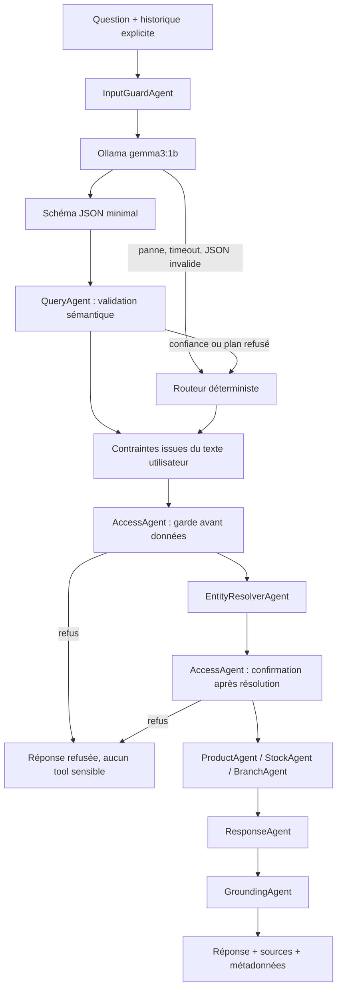

# Architecture de l’agent IA HBntory

## Objectif

L’agent répond aux questions sur le catalogue fournisseur, les prix, les
stocks et les agences sans laisser le modèle inventer une donnée ou décider
d’un droit d’accès.

La stratégie retenue est **LLM-first avec exécution déterministe** :

```text
Ollama identifie la demande
        ↓
validation et contraintes déterministes
        ↓
contrôle d’accès déterministe
        ↓
appel des tools déterministes
        ↓
réponse fondée sur les données et leurs sources
```

Ollama est donc un planificateur sémantique. Il n’est ni la base de
connaissances, ni le moteur d’autorisation, ni le générateur de la réponse
métier finale.

## Vue d’ensemble



## Contrat minimal avec Ollama

Le modèle reçoit la question courante et les dernières questions utilisateur.
Il retourne uniquement :

```json
{
  "intents": ["stock_lookup"],
  "product_query": "écran 27 pouces",
  "branch": "Lyon",
  "used_history": false,
  "confidence": 0.92
}
```

Le format est imposé par un schéma JSON Ollama. Le contrat reste volontairement
petit pour être fiable et rapide avec `gemma3:1b`.

Le modèle peut sélectionner ces intentions :

| Intention | Usage |
|---|---|
| `product_detail` | prix, description ou fiche d’un produit |
| `product_search` | recherche par type, caractéristique ou prix |
| `stock_lookup` | quantité d’un produit dans une agence |
| `stock_by_product` | agences où un produit est disponible |
| `stock_by_branch` | vue complète du stock d’une agence |
| `branch_info` | existence, adresse ou horaires d’une agence |
| `branch_list` | liste des agences |
| `access_info` | rôle et périmètre de l’utilisateur |
| `access_management` | demande de modification d’accès |
| `out_of_scope` | question hors périmètre HBntory |

## Validation déterministe

Le plan LLM est accepté uniquement si :

- toutes les intentions appartiennent à la liste autorisée ;
- la confiance atteint `AI_LLM_MIN_CONFIDENCE` ;
- le produit et l’agence proviennent de la question ou de l’historique ;
- l’agence de la question courante n’est pas remplacée par une ancienne
  agence de l’historique ;
- une intention sensible n’est pas sous-classée ;
- les intentions secondaires non demandées sont retirées.

Les contraintes mesurables ne sont jamais confiées au modèle. Elles sont
recalculées depuis la question :

- catégorie produit : laptop, écran, clavier, souris ou casque ;
- prix minimum et maximum ;
- devise USD ou EUR ;
- agrégation de plusieurs produits d’une même catégorie ;
- filtres de rupture ou de stock faible ;
- agence citée dans la question courante.

Ainsi, « écran à moins de 100 $ » ne peut pas retourner un écran à 169,99 $,
même si Ollama oublie le filtre.

## Résolution produit

`EntityResolverAgent` lit le catalogue complet depuis Product MCP puis :

1. applique les contraintes de catégorie, prix et devise ;
2. recherche une référence exacte, un SKU ou un nom ;
3. applique les alias français/anglais ;
4. classe les correspondances ;
5. demande une clarification lorsqu’un produit précis reste ambigu.

La catégorie « PC portable » sélectionne les produits de catégorie `Laptops`.
Les accessoires contenant le mot « Laptop » — sac, chargeur ou housse — sont
exclus de cette catégorie.

Pour « combien de PC portables à Paris », les modèles correspondants sont
résolus, chaque stock est lu par son identifiant externe, puis les quantités
sont totalisées.

## Historique et questions de suivi

Le service reste stateless. Le client transmet l’historique utile avec chaque
requête.

Exemples :

- « Laptop Charger est à quel prix ? » puis
  « Dans quelles autres boutiques puis-je le trouver ? » devient
  `stock_by_product` pour le même chargeur ;
- « Un écran 27 pouces est-il disponible à Lyon ? » puis
  « Et à Paris ? » conserve le produit mais remplace Lyon par Paris ;
- une agence ancienne ne peut jamais écraser une agence explicitement citée
  dans la question courante.

## Contrôle d’accès

L’identité vient exclusivement du cookie JWT `HttpOnly` résolu par
`/auth/me`. Un rôle ou une agence envoyés dans le JSON de `/ask` ne sont pas
acceptés.

| Profil | Catalogue | Stock d’un produit | Stock complet d’une agence | Modification d’accès |
|---|---:|---:|---:|---:|
| Anonyme | oui | oui | non | non |
| Common | oui | oui | son agence | non |
| Admin | oui | oui | toutes les agences | non dans le chat |

Le premier contrôle intervient avant la résolution des données. Le second
confirme la décision avec les entités réellement résolues avant le tool
métier.

## Sources de vérité

| Donnée | Source |
|---|---|
| catalogue, SKU, nom, prix, catégorie | API fournisseur via Product MCP |
| quantité par produit et agence | API interne du backoffice |
| agences | API interne du backoffice |
| identité, rôle et agence utilisateur | backoffice `/auth/me` |

`GroundingAgent` empêche une réponse métier sans preuve ou sans source.

## Repli et observabilité

Si Ollama échoue, le service continue avec le routeur déterministe. La réponse
expose la décision :

```json
{
  "planning": {
    "source": "deterministic_fallback",
    "status": "fallback",
    "confidence": 0.9,
    "failure_code": "llm_semantic_override"
  }
}
```

Principaux codes :

| Code | Signification |
|---|---|
| `llm_unavailable` | Ollama ne répond pas |
| `llm_model_unavailable` | modèle absent |
| `llm_invalid_response` | réponse non conforme au schéma |
| `llm_low_confidence` | confiance sous le seuil |
| `llm_ungrounded_branch` | agence inventée |
| `llm_history_branch_conflict` | ancienne agence opposée à la question courante |
| `llm_scope_conflict` | question métier classée hors périmètre |
| `llm_semantic_override` | intention incompatible avec une règle métier forte |
| `llm_security_override` | sous-classification d’une opération sensible |

`GET /health` expose également :

- `llm_enabled` ;
- `llm_model` ;
- `llm_reachable` ;
- `llm_model_available`.

## Configuration

Ollama tourne sur la machine hôte, pas dans Docker :

```env
AI_LLM_ENABLED=true
OLLAMA_API_BASE=http://host.docker.internal:11434
MODEL_NAME=gemma3:1b
OLLAMA_TIMEOUT_SECONDS=15
AI_LLM_MIN_CONFIDENCE=0.65
```

Installation du modèle sur l’hôte :

```bash
ollama pull gemma3:1b
ollama serve
```

## Tests de référence

Les régressions couvrent notamment :

- « Combien y a-t-il de PC portables à Paris ? » ;
- « Dans quelles autres boutiques puis-je trouver le Laptop Charger ? » ;
- « Je cherche un écran à moins de 100 $ » ;
- « Quelles sont les agences HBntory ? » ;
- « Quels sont les horaires de l’agence de Lyon ? » ;
- « Écran 27 pouces à Lyon » puis « Et à Paris ? » ;
- refus du stock complet pour un anonyme ;
- refus des mutations d’accès depuis le chat.

Commandes :

```bash
PYTHONPATH=ai_service python3 -m unittest discover -s ai_service/tests -q
python3 -m unittest discover -s product_mcp_server/tests -q
docker compose config --quiet
docker compose up -d --build
```

