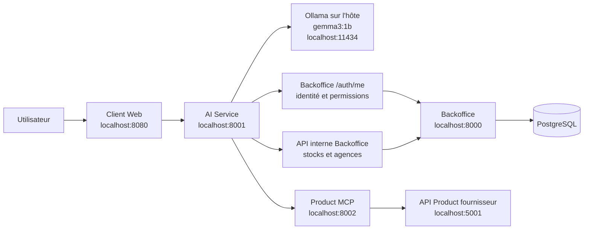
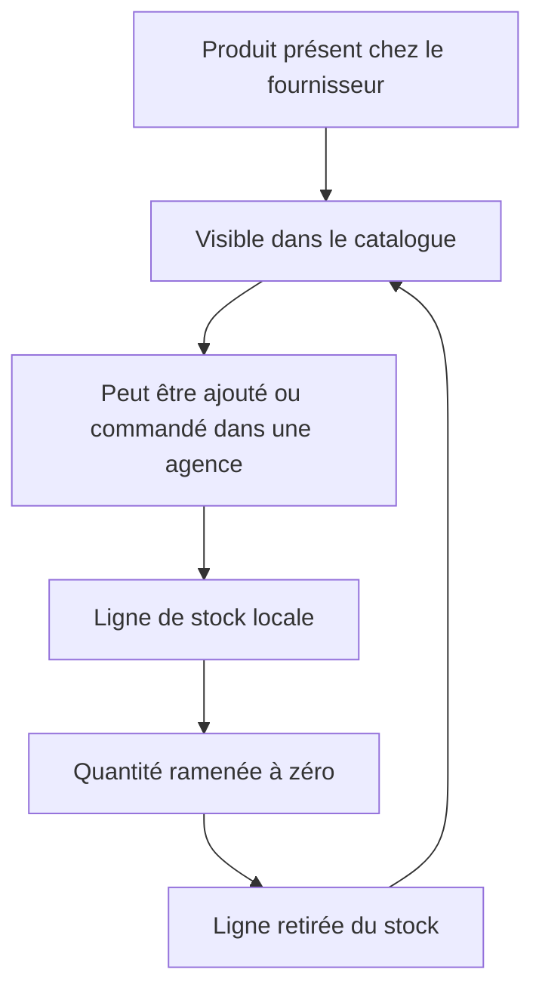
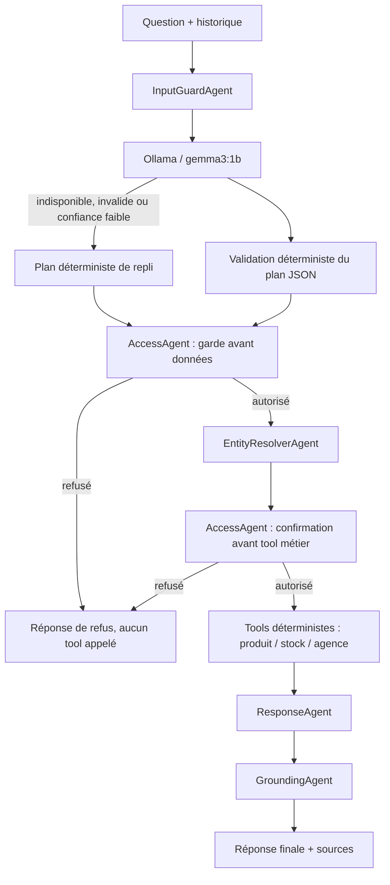

# HBntory — Synthèse d'architecture et stratégie IA

Dernière mise à jour : 29 juillet 2026  
Branche de travail : `feat/ai-agent`

## 1. Résumé exécutif

HBntory sépare volontairement trois types de données :

1. le **catalogue fournisseur**, qui contient tous les produits disponibles
   dans l'API Product ;
2. le **stock local**, qui contient uniquement la quantité d'un produit dans
   une agence ;
3. l'**identité utilisateur**, qui détermine les données de stock que la
   personne peut consulter.

Supprimer une ligne de stock ne supprime donc jamais le produit du catalogue.
Le produit reste disponible à la commande tant qu'il est fourni par l'API
Product.

Le chatbot utilise désormais une architecture hybride LLM-first :

- Ollama avec `gemma3:1b` identifie chaque question validée ;
- du code déterministe valide le plan, contrôle les autorisations et appelle
  les données ;
- des règles déterministes reprennent la planification si Ollama échoue ;
- des réponses construites uniquement à partir des données réelles renvoyées
  par le Product MCP et le backoffice.

Le modèle ne reçoit pas le droit de modifier les stocks, les utilisateurs ou
les accès.

## 2. Architecture générale



### Responsabilité de chaque service

| Service | Responsabilité | Source de vérité |
|---|---|---|
| API Product fournisseur | Tous les produits disponibles à l'opérateur | Catalogue produit |
| Product MCP | Lecture, pagination et normalisation du catalogue | API Product |
| Backoffice | Utilisateurs, agences et quantités locales | PostgreSQL |
| AI Service | Compréhension, contrôle d'accès et orchestration | Aucune donnée métier persistée |
| Ollama | Interprétation sémantique de chaque question validée | Aucun accès direct aux données |
| Client Web | Conversation et transmission de l'historique | Mémoire locale de l'interface |

## 3. Catalogue et stock : règle fonctionnelle centrale

Le catalogue et le stock ont des cycles de vie différents.



- Le catalogue est relu depuis l'API fournisseur.
- La pagination est parcourue jusqu'à obtenir toutes les pages annoncées par
  l'API.
- PostgreSQL conserve seulement l'identifiant externe et la quantité par
  agence, sans recopier la fiche produit.
- Une suppression dans « Mon stock » supprime uniquement la relation locale
  agence/produit.
- Le catalogue permet ensuite de retrouver et recommander ce même produit.

Les listes de stock sont triées par quantité croissante, puis par nom de
produit dans l'ordre alphabétique lorsque les quantités sont identiques.

## 4. Workflow IA modulaire



### Ce qui « raisonne »

Ollama est le planificateur principal. Il doit seulement retourner :

```json
{
  "intents": ["stock_lookup"],
  "product_query": "écran 27 pouces",
  "branch": "Lyon",
  "used_history": false,
  "confidence": 0.91
}
```

Ce contrat minimal est imposé par un schéma JSON afin de rester fiable avec
`gemma3:1b`. Le code rejette les intentions inconnues, les entités mal
formées, les agences absentes de la question, les plans incohérents et les
confiances trop faibles.
La requête produit envoyée aux tools est reconstruite à partir des mots de
l'utilisateur, jamais à partir d'un produit inventé par le modèle.

Les catégories, bornes de prix, devises et agrégations sont extraites à
nouveau par du code déterministe. La documentation canonique est
`docs/ai_agent_architecture.md`.

Sans Ollama, ou si ce plan échoue, `QueryAgent` applique ses règles de repli :

- normalisation des accents et de la ponctuation ;
- détection de mots-clés métier ;
- reconnaissance des alias produit ;
- récupération du contexte pour « Et à Paris ? ».

Ollama ne produit jamais la réponse finale. Il ne peut pas appeler les tools,
modifier la base ou décider seul d'un accès.

### Pourquoi une architecture hybride

| Besoin | Réponse architecturale |
|---|---|
| Comprendre plusieurs formulations naturelles | Ollama interprète chaque question |
| Continuer à répondre en cas de panne LLM | Routeur déterministe de repli |
| Ne pas inventer une quantité ou un prix | Réponse fondée sur les API réelles |
| Protéger les stocks des autres agences | Politique d'accès déterministe |
| Continuer si Ollama est indisponible | Repli automatique sur les règles |
| Faciliter les tests | Agents stateless et clients de données injectables |

## 5. Agents et responsabilités

| Agent | Rôle |
|---|---|
| `InputGuardAgent` | Valide et normalise la question |
| `QueryAgent` | Produit les intentions métier |
| `EntityResolverAgent` | Identifie produit et agence dans les données réelles |
| `AccessAgent` | Applique les droits selon l'identité authentifiée |
| `ProductAgent` | Répond sur le catalogue, le prix et la fiche produit |
| `StockAgent` | Répond sur une quantité, un produit ou une agence |
| `BranchAgent` | Répond sur les agences |
| `ResponseAgent` | Assemble les résultats des agents spécialisés |
| `GroundingAgent` | Refuse une réponse métier sans preuve ou source |

Le workflow est **stateless** : aucune identité ou conversation globale n'est
partagée entre utilisateurs. L'historique utile est envoyé explicitement avec
chaque requête.

## 6. Authentification et stratégie d'accès

L'AI Service ne fait jamais confiance à un rôle ou à une agence envoyés dans
le JSON du navigateur.

1. Le navigateur transmet automatiquement le cookie JWT `HttpOnly`.
2. L'AI Service appelle `/auth/me`.
3. Le backoffice retourne l'utilisateur, son rôle et son agence actuels.
4. `AccessAgent` applique la politique métier.

| Profil | Catalogue | Stock d'un produit précis | Stock complet d'une agence | Gestion d'accès par chat |
|---|---:|---:|---:|---:|
| Anonyme | Oui | Oui | Non | Non |
| Common | Oui | Oui | Son agence uniquement | Non |
| Admin | Oui | Oui | Toutes les agences | Lecture seule |

Une demande telle que « donne accès à Alice » ne modifie rien. Même pour un
administrateur, le chatbot renvoie vers l'écran Utilisateurs du backoffice.

## 7. Configuration Ollama sur la machine hôte

Ollama n'est pas exécuté dans Docker. Le conteneur `ai-service` se connecte au
serveur Ollama installé sur l'ordinateur via `host.docker.internal`.

Variables actives :

```env
AI_LLM_ENABLED=true
OLLAMA_API_BASE=http://host.docker.internal:11434
MODEL_NAME=gemma3:1b
OLLAMA_TIMEOUT_SECONDS=15
AI_LLM_MIN_CONFIDENCE=0.65
```

Sur l'hôte, installe et démarre le modèle :

```bash
ollama pull gemma3:1b
ollama serve
```

Si nécessaire, utilise `OLLAMA_HOST=0.0.0.0:11434 ollama serve` pour rendre le
port joignable depuis Docker Desktop. Docker ne télécharge ni ne conserve le
modèle.

Le modèle `gemma3:1b` représente environ 815 Mo. Il a été choisi comme
compromis entre :

- une empreinte suffisamment faible pour un poste de développement ;
- une meilleure compréhension du français que la variante 270M ;
- la capacité à produire le petit objet JSON attendu par `QueryAgent`.

Le timeout d'interprétation est fixé à 15 secondes. Les réglages de
conservation en mémoire et de contexte
restent ceux du serveur Ollama local. Si Ollama ne répond pas dans le délai ou
renvoie un JSON invalide, le service continue avec le plan déterministe.

## 8. API de conversation

Requête :

```http
POST /ask
Content-Type: application/json
```

```json
{
  "question": "Y a-t-il un écran 27 pouces dans l'agence de Lyon ?",
  "conversation_id": "conversation-123",
  "history": [
    {
      "role": "user",
      "content": "Je cherche un écran 27 pouces."
    }
  ]
}
```

La réponse expose notamment :

- `answer` : réponse utilisateur ;
- `intent` : intention principale ;
- `status` : répondu, refusé, erreur ou clarification ;
- `agent` : agents métier réellement utilisés ;
- `sources` : systèmes ayant fourni les preuves ;
- `access` : portée d'accès effective ;
- `planning` : planificateur retenu, confiance et code de repli éventuel ;
- `used_history` : indication de réutilisation du contexte.

Exemple de défaillance exposée sans détail sensible :

```json
{
  "planning": {
    "source": "deterministic_fallback",
    "status": "fallback",
    "confidence": 0.9,
    "failure_code": "llm_unavailable"
  }
}
```

Un comportement réel a été observé pendant le test : `gemma3:1b` a classé
« tout le stock de l'agence » comme une consultation de produit précis. La
garde déterministe a donc été étendue aux intentions sensibles
`stock_by_branch` et `access_management`. En cas de désaccord, aucun tool
sensible n'est appelé et la réponse expose
`failure_code: "llm_security_override"`.

`/health` indique si le LLM est activé, si Ollama est joignable et si
`gemma3:1b` est réellement présent.

## 9. Travaux réalisés pendant la session

### Backoffice et catalogue

- Le catalogue a été défini comme l'ensemble complet des produits fournis par
  l'API Product.
- La récupération multi-pages a été sécurisée dans le backoffice et le
  Product MCP.
- La suppression d'un produit du stock ne le supprime plus du catalogue.
- La liste de stock est triée par quantité croissante puis par nom.
- La navigation de la vue stock ne présente plus de sous-lignage
  indésirable.

### Product MCP

- Parcours des pages avec `limit`, `offset` et `count`.
- Compatibilité avec plusieurs formes historiques de réponse.
- Détection des pages répétées et des catalogues incomplets.
- Limite de sécurité empêchant une boucle de pagination infinie.

### Service IA

- Remplacement de l'agent monolithique par un workflow modulaire.
- Ajout de la résolution d'entités produit/agence.
- Ajout de la politique d'accès par profil.
- Ajout des questions de suivi avec historique.
- Ajout de réponses fondées sur les sources réelles.
- Ajout d'Ollama comme planificateur principal avec repli déterministe.
- Ajout de la validation des plans LLM et de l'observabilité des replis.
- Déplacement du contrôle d'accès avant tout accès aux données.
- Conservation d'une façade compatible avec l'ancien service.

### Client Web

- Transmission d'un identifiant de conversation.
- Envoi des derniers messages utiles au service IA.
- Prise en charge de questions de suivi comme « Et le prix ? » ou
  « Et à Paris ? ».

### Intégration et Git

- La branche `feat/ai-agent` est basée sur `main` au commit `90026ff`.
- Le workflow multi-agents est enregistré dans le commit `a8aff0e`.
- Les apports des branches collaboratrices concernant le MCP, le service IA
  et le backoffice sont présents dans l'historique de `main`.

## 10. Vérifications

Les vérifications automatisées couvrent :

- les intentions et les enchaînements d'agents ;
- la disponibilité d'un écran 27 pouces à Lyon ;
- les recherches ambiguës ;
- les questions catalogue, prix et stock ;
- la réutilisation de l'historique ;
- les refus d'accès par profil ;
- l'identité issue du cookie ;
- les pannes des services de données ;
- la pagination complète du catalogue MCP.

Commandes :

```bash
PYTHONPATH=ai_service python3 -m unittest discover -s ai_service/tests -q
python3 -m unittest discover -s product_mcp_server/tests -q
docker compose config --quiet
```

Test de bout en bout recommandé :

```bash
docker compose up -d --build
curl http://localhost:8001/health
curl http://localhost:11434/api/tags
```

Puis ouvrir `http://localhost:8080` et poser :

> Y a-t-il un écran 27 pouces dans l'agence de Lyon ?

## 11. Limites et évolutions possibles

1. `gemma3:1b` reste un petit modèle : certaines formulations complexes
   pourront nécessiter une clarification.
2. Le LLM sert uniquement de planificateur de requête. La formulation finale
   reste déterministe pour garantir la fidélité aux données.
3. La politique utilisateur ne gère actuellement qu'une agence principale
   par utilisateur.
4. Le chat reste volontairement en lecture seule.
5. En cas de repli, la réponse reste fonctionnelle mais
   `planning.failure_code` doit être surveillé pour détecter une panne Ollama.

## 12. Critères de réussite

La chaîne est considérée opérationnelle lorsque :

- le serveur Ollama de l'hôte répond à `/api/tags` et contient `gemma3:1b` ;
- `/health` annonce `llm_enabled: true`, `llm_reachable: true` et
  `llm_model_available: true` ;
- le catalogue renvoie toutes les pages du fournisseur ;
- une question produit/stock renvoie des sources réelles ;
- un utilisateur `common` ne peut pas lire le stock complet d'une autre
  agence ;
- la suppression d'une ligne de stock laisse le produit visible dans le
  catalogue.
